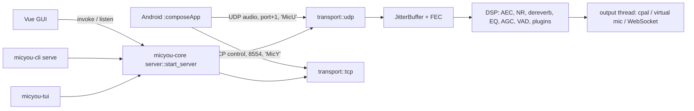

# Repository Guidelines

## Overview

MicYou turns an Android phone into a PC microphone: the phone captures and streams audio, the desktop receives it and plays it into a virtual mic (VB-CABLE on Windows, BlackHole on macOS, PipeWire on Linux) or serves it to a browser over HTTPS

Two codebases share one wire protocol:

- `composeApp/`: the Android client, a single Gradle module (Kotlin, Jetpack Compose, Material 3)
- `tauri-app/`: the desktop app, a Rust workspace plus a Vue 3 frontend; one Tauri-free core (`micyou-core`) drives three frontends: GUI (`micyou`), CLI (`micyou-cli`) and TUI (`micyou-tui`)



## Wire protocol

- Source of truth: `tauri-app/crates/micyou-protocol/proto/network.proto` (prost); the Android mirror is `composeApp/.../network/Protocol.kt` and must stay in sync, magics included (`0x4D696359` control, `0x4D696355` audio)
- TCP carries control frames (connect, mute, ping, pong) with a 1 MiB payload cap enforced on both sides
- UDP carries audio on TCP port + 1; Opus uses 20 ms frames with one FEC packet per group of 12
- Connection modes: **wifi** (LAN, mDNS `_micyou._tcp.`), **usb** (`adb reverse`, connections arrive on loopback so the saved bind interface is ignored), **web** (axum TLS WebSocket, feature-gated)

## Android client

- One `MainActivity` hosting Compose (`App.kt` → `MobileHome`); no Fragments or Navigation; dialogs are state-driven
- MVVM: `AudioStreamViewModel` (owns `AudioEngine` and mDNS discovery), `SettingsViewModel` and `UpdateViewModel` are combined by the facade `MainViewModel` into a single `AppUiState` StateFlow
- `audio/AudioEngine.kt`: `AudioRecord` capture → Kotlin DSP → TCP/UDP transport; heartbeat timing uses `SystemClock.elapsedRealtime`
- `service/AudioService.kt`: foreground service, type `microphone` while streaming and `mediaPlayback` while idle; returns `START_NOT_STICKY` and never reschedules itself (exact alarms throw on Android 14+); swiping the app away stops streaming, removes the notification and stops the service
- `service/MicYouTileService.kt`: Quick Settings tile that starts and stops streaming
- Settings live in SharedPreferences (`android_mic_prefs`), not DataStore, modelled as enums in `audio/AudioSettings.kt`; wire constants live in `util/Constants.kt` and `network/Protocol.kt`
- Haze is reached only through `ui/compose/haze/HazeBridge.kt`, which exists twice: `src/normal` maps onto Haze 2 `hazeBlur`, `src/compat` draws a plain background

### api21 compat build

- Enabled with `-Pmicyou.androidCompat=api21`; downgrades are pinned in `settings.gradle.kts`, and every library that needs compileSdk 37 must be pinned back there
- kotlin-android is applied through `apply()`, so `composeApp/build.gradle.kts` configures `KotlinAndroidProjectExtension` by type instead of a `kotlin {}` block
- `androidx.activity` is forced to 1.8.2; a library built against a newer activity compiles but throws `NoSuchMethodError` at runtime (why the background picker uses `PickVisualMedia` directly instead of FileKit)
- Compat APKs ship only 32-bit ABIs and will not install on arm64-only phones

## Desktop backend

Workspace crates under `tauri-app/crates/`:

| Crate | Role |
|---|---|
| `micyou-protocol` | prost wire format and magic constants |
| `micyou-infer` | zero-dependency pure-Rust VM for the statically compiled MCYI model blobs (PureVox6 / AEC7); replaces ort/ONNX Runtime, see `docs/pure-rust-inference.md` |
| `micyou-core` | everything server-side, no Tauri dependency: `server/` (state, lifecycle, service, audio pipeline, output), `transport/` (tcp, udp, web, jitter buffer, opus, session, net_bind), `plugins/`, `platform/` (adb, pipewire, vbcable, blackhole, accent, firewall, terminal), `config`, `settings`, `events`, `host`, `modes`, `mode_lock` |
| `micyou-audio` | cpal output engine, DSP chain (native PureVox6/AEC7 models embedded via `micyou-infer`, RNNoise noise suppression), loopback capture |
| `micyou-plugin` | plugin runtime: manifest, WASM sandbox (wasmi with fuel limits), native C ABI (libloading), bus, DSP hook |
| `micyou-cli`, `micyou-tui` | headless frontends on `micyou-core`, no Tauri in their dependency tree; bundled into the GUI as Tauri sidecars (`externalBin`) by `prepare-sidecars.js` |

`tauri-app/src-tauri/` is a thin GUI shell: `app.rs` (builder, setup, every command in `invoke_handler`), `commands/`, `events.rs` (`TauriEventSink`), `host.rs` (`TauriHost`), `tray.rs`, `window.rs`, `kwin_effects.rs` (KWin blur and shadow on the GDK Wayland surface)

Data path:

- `transport::udp` validates datagrams into an `mpsc(128)` channel
- `server::audio_pipeline` runs on its own thread: the jitter buffer reorders and FEC-recovers, the prebuffer is sized in time (100 ms), PCM is decoded (16/8/float/24-bit, non-finite samples zeroed), then the DSP chain runs with AEC pinned first
- `server::output` owns the cpal device on a dedicated `micyou-output` thread fed by a channel; queued latency is published through an atomic, and shutdown waits up to 1 s for the thread
- Plugin DSP nodes that fail 50 frames in a row are quarantined; non-finite plugin output is zeroed

Frontend integration:

- Every frontend builds `ServerState::new(events, host, resource_hint)` and calls `server::start_server` / `stop_server`; runtime controls (mute, monitoring, DSP settings) go through `ServerState::controls()`, which the plugin host API shares
- Events fan out through the `ServerEvents` trait: `TauriEventSink`, `CliEventSink` (log lines), `TuiEventSink` (throttled channel)
- OS integration (open URL, notify, global hotkeys, plugin panel windows) goes through `HostIntegration`: `TauriHost` for the GUI, `HeadlessHost` (feature `headless-host`) for CLI and TUI
- GUI, CLI and TUI exclude each other through a `mode.lock` file

Shared config in `~/.config/micyou/` (Linux) or `%APPDATA%\micyou` (Windows), read and written by all three frontends: `settings.json` (DSP), `server.json` (port 8554, webPort 8443, mode, bindAddress, outputDevice), `ui.json` (language, theme), `theme.json` (theme colors exported from the GUI to CLI and TUI)

## Desktop frontend

- Vue 3 + Vite + Tailwind 4; entry `src/main.ts` routes by hash: `#/settings` → `SettingsWindow`, `#/plugin/` → `PluginPanelWindow`, otherwise `App.vue`
- Layout: `src/platform/` (the only code allowed to import `@tauri-apps/*`), `src/features/` (audio, connection, onboarding, plugins, pocket, settings, theme, tray, window), `src/shared/` (`lib/os.ts`, `lib/utils.ts`, `lib/listeners.ts`, `components/ui`, locales, assets), `src/i18n.ts`
- No Pinia: state lives in singleton composables (`useServer`, `useAudio`, `useTheme`, `useWindow`, `useTray`) instantiated in `App.vue` and passed through props and events
- Backend access: `command('snake_case_cmd', args)` typed by the `Commands` map in `platform/commands.ts`, `onEvent('event-name', cb)` typed by `AppEvents` in `platform/events.ts`; add new commands and events there first
- Event listeners go through `useListeners()` from `shared/lib/listeners.ts`: `track(onEvent(...))` unlistens on scope dispose, including registrations that resolve after disposal
- Every invoke is try/catch-wrapped with an optimistic update and rollback; connection errors funnel into `ConnectionErrorDialog` via `utils/connectionError.ts`
- UI-only prefs persist through `@vueuse/core` `useStorage` with `micyou_*` keys; anything CLI or TUI also reads belongs in the shared config files
- Windows are frameless and transparent with self-drawn chrome; mark glass panels with `data-blur-region` so `useWindowEffects` requests matching native blur
- Rounded window corners are per platform: DWM corner preference on Windows, NSWindow corner radius via vibrancy on macOS, and a `clip-path` on `body` only under `.platform-linux` — do not clip the document on Windows/macOS, the full-page clip mask made streaming animations stutter in WebView2
- Continuous animations (the streaming glow and status dot loops) are CSS keyframe animations on transform/opacity so the compositor drives them; keep JS animation libraries (anime.js) for one-shot interactions only
- The settings window is a separate webview (`features/settings/components/SettingsWindow.vue` plus one component per page under `sections/`); it shares state with the main window through `useStorage` storage events and `emitToWindow('main', …)`, drags from any non-control element marked `data-drag-surface`, and dialogs inside a section use `<Teleport to="body">` to escape the page transition
- Styling: the theme lives in the `@theme inline` block of `src/shared/assets/index.css` (no `tailwind.config.js` or PostCSS config); Material 3 HSL variables, 8 themes in light and dark via `.dark`; shadcn color names (`popover`, `accent`, `muted`, …) are aliased to Material 3 tokens; a scoped `<style>` using `@apply` needs `@reference "@/shared/assets/index.css";`; `cn()` = `twMerge(clsx(...))`
- `src/shared/components/ui/` holds only what is used (reka-ui `select`, `MD3Slider`, `MD3Switch`); use `MD3Switch` for toggles
- `tauri.linux.conf.json` pins the main window with min = max size because GTK3 grows non-resizable windows by 48 px on Wayland
- Audio devices are listed, saved and matched through `micyou_audio::device_name`, never `cpal::Device::description()` (on ALSA it keeps the PCM name stored in `server.json`)

## Commands

```bash
# Android, from the repo root
./gradlew :composeApp:assembleDebug
./gradlew :composeApp:assembleRelease

# Desktop, from tauri-app/
bun run dev            # licenses + Vite on port 1420 (strict)
bun run build          # licenses + vue-tsc --noEmit + vite build
bun run tauri dev      # prepare-sidecars:dev + dev
bun run tauri build    # sync-version + prepare-sidecars + build
cargo test             # all Rust unit tests
cargo clippy --workspace --all-targets
cargo run -p micyou-cli -- serve
cargo run -p micyou-tui
```

`bun run tauri` goes through `run-tauri.js`, which sets `NO_STRIP=1` on Linux (linuxdeploy's strip cannot read RELR sections) and frees port 1420 before `dev`

## Conventions

- **Versioning**: bump only `project.version` and `project.version.code` in `gradle.properties`; `bun run sync-version` propagates to `tauri.conf.json`, `src-tauri/Cargo.toml`, the workspace `Cargo.toml`, `package.json`, `src-tauri/installer.iss` and `Cargo.lock`, and runs automatically on every `tauri build`
- **Localization**: never hardcode user-facing strings; adding or renaming a key means updating every locale file
  - Android: `composeApp/src/main/res/values*/strings.xml` (`values` English base, `values-en`, `values-zh`, `values-zh-rTW`, `values-zh-rHK`, plus easter eggs `values-zh-rHD` and `values-ca`), registered in `util/Localization.kt` (`AppLanguage`)
  - Desktop: `tauri-app/src/shared/locales/*.json` (`en` base, `zh`, `zh-hk`, `zh-tw`, `zh-ss`, `cat`, `lzh`), registered in `src/i18n.ts`
  - Technical error text logged or sent over the wire stays English and unlocalized
- **Rust**: Tauri commands are `snake_case`; long-lived state is `Arc`-wrapped inside `ServerState`; lifecycle is serialized by `ServerLifecycleGate` + `CancellationToken`; serde config uses `camelCase`; recover poisoned locks with `unwrap_or_else(|p| p.into_inner())` instead of propagating errors; keep tests inline in `#[cfg(test)]` modules
- **Defensive code**: validate at trust boundaries (network frames, plugin output, zip archives, plugin ids, config files) and keep the inside lean; prefer bounded limits and quarantine over panics
- **Communication**: use Chinese for code reviews, issue and PR comments and any other user-facing communication; commit messages are English `<type>: <description>`

## Testing and QA

- Rust unit tests live mostly in `micyou-core`, plus `micyou-audio`, `micyou-plugin`, `micyou-tui` and `src-tauri`; `micyou-protocol` and `micyou-cli` have none; there are no integration test directories
- Android has no tests (kotlin-test in the version catalog is unused)
- Gates to keep green: `cargo test`, `cargo clippy`, `bun run build` (the only frontend type check) and `./gradlew :composeApp:assembleDebug`; there is no lint or format wiring, `.prettierrc` exists but nothing runs it
- End-to-end verification is manual: phone → server → virtual mic; `micyou-cli serve` with `adb reverse` is the quickest desktop side for device tests
- CI (`.github/workflows/`): `development.yml` builds the debug APK and Tauri bundles on Windows, macOS (arm64 and x86_64) and Linux; `release.yml` and `pre-release.yml` publish GitHub and MirrorChyan releases; Android jobs run with `continue-on-error: true` and never block releases; `opencode.yml` runs an AI review on PR comments

## Toolchain

- Android: JDK 21 (Java 11 bytecode), Gradle 9.8.0 wrapper, AGP 9.4.1, Kotlin 2.4.20, compileSdk 37, targetSdk 36, minSdk 24, build-tools 36.1.0; versions live in `gradle/libs.versions.toml`; optional `local.properties` keys `AIFADIAN_API_TOKEN`, `AIFADIAN_USER_ID`
- Release signing needs all of `ANDROID_KEYSTORE_PATH`, `ANDROID_KEYSTORE_PASSWORD`, `ANDROID_KEY_ALIAS`, `ANDROID_KEY_PASSWORD`, otherwise release builds are unsigned; CI uses `ANDROID_KEYSTORE_BASE64`
- Desktop: Bun pinned by `packageManager` in `package.json` (CI runs `bun install --frozen-lockfile`), Rust stable edition 2021, Tauri CLI 2
- `generate-licenses.js` reads the production tree from `bun.lock` and reruns cargo-about only when inputs change (`bun generate-licenses.js --force` rebuilds); output goes to `src/generated/`

## Leftovers

- `composeApp/micyou.conf` is gitignored with zero code references
- `docs/FAQ*.md` are redirect stubs; the content lives at micyou.top
