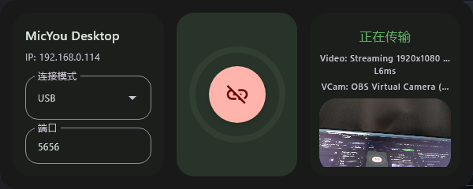
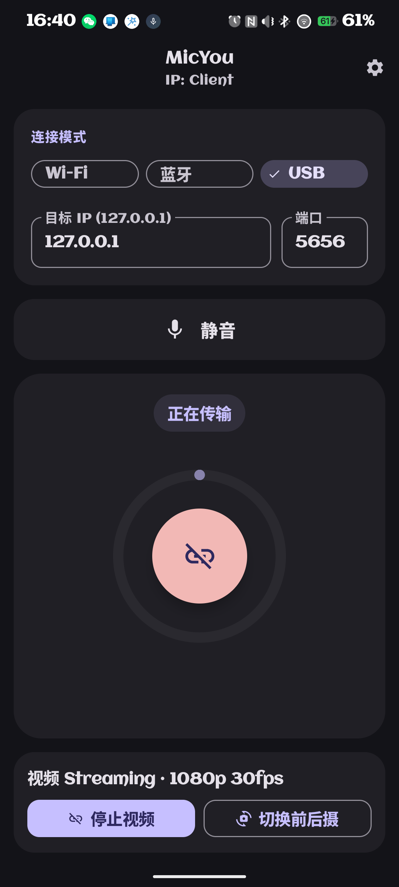

# MicYou

<p align="center">
  
</p>

MicYou 是一个将 Android 手机变成电脑麦克风/摄像头输入的工具，基于 Kotlin Multiplatform 与 Jetpack Compose 构建。

## 预览安装包（PR #44）

- [MicYou-windows-1.1.0.zip](https://github.com/fguyfguiyytu/MicYou/releases/download/pr44-preview-20260219/MicYou-windows-1.1.0.zip)
- [composeApp-debug.apk](https://github.com/fguyfguiyytu/MicYou/releases/download/pr44-preview-20260219/composeApp-debug.apk)
- 暂不支持 Linux

## 主要功能

- 支持 Wi-Fi / USB / 蓝牙连接模式
- 支持音频处理（降噪、AGC、去混响）
- 支持 Android 端发送、桌面端接收
- 支持虚拟麦克风与虚拟摄像头相关能力
- 支持视频传输与桌面端预览

## 截图

### Android

| 主界面 | 设置界面 |
|:--:|:--:|
|  |  |

### Desktop


### 新增截图





## 使用说明

### Android

1. 安装 `composeApp-debug.apk`
2. 打开应用并授予麦克风/摄像头权限
3. 选择连接模式并填写目标地址

### Windows

1. 解压并运行 `MicYou-windows-1.1.0.zip` 中的程序
2. 选择与手机一致的连接模式
3. 先连接桌面端，再在手机端开启音频/视频

## 源码构建

### Android APK

```bash
./gradlew :composeApp:assembleDebug
```

### Windows ZIP

```bash
./gradlew :composeApp:packageWindowsZip
```

## 常见问题

- 见 `docs/FAQ_ZH.md`

## Star History

[](https://star-history.com/#lanrhyme/MicYou&Date)
