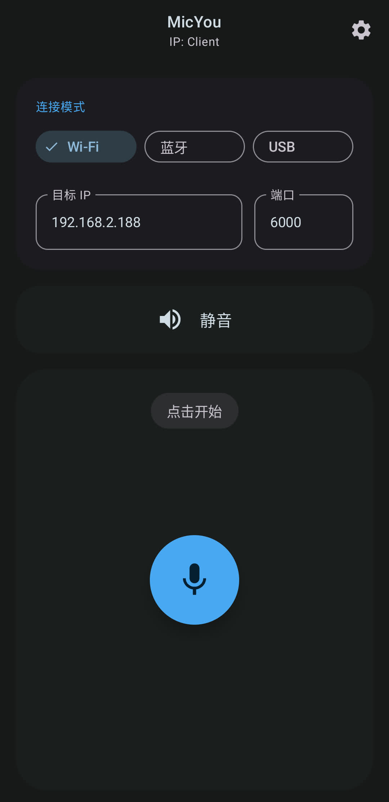

# MicYou

<p align="center">
  
</p>

<p align="center">
  <b>简体中文</b> | <a href="./README_TW.md">繁體中文</a> | <a href="./README.md">English</a>
</p>

MicYou 是一款强大的工具，可以将您的 Android 设备变成 PC 的高质量无线麦克风，于 Kotlin Multiplatform 和 Jetpack Compose/Material 3 构建

本项目基于 [AndroidMic](https://github.com/teamclouday/AndroidMic) 开发

## 主要功能

- **多种连接模式**：支持 Wi-Fi、USB (ADB/AOA) 和蓝牙连接
- **音频处理**：内置噪声抑制、自动增益控制 (AGC) 和去混响功能
- **跨平台支持**：
  - **Android 客户端**：现代 Material 3 界面，支持深色/浅色主题
  - **桌面端服务端**：支持 Windows/Linux 接收音频
- **虚拟麦克风**：配合 VB-Cable 可作为系统麦克风输入使用
- **高度可定制**：支持调整采样率、声道数和音频格式

## 软件截图

### Android 客户端
|                            主界面                            |                              设置                               |
|:---------------------------------------------------------:|:-------------------------------------------------------------:|
|  |  |

### 桌面端


## 使用指南

### Android
1. 下载并安装 APK 到您的 Android 设备
2. 确保您的设备与 PC 处于同一网络（Wi-Fi 模式），或通过 USB 连接

### Windows
1. 运行桌面端应用程序
2. 配置连接模式以匹配 Android 应用

### macOS

> [!IMPORTANT]
> 如果您使用的是 Apple Silicon Mac，在不使用 Rosetta 2 转译的前提下无法使用蓝牙模式

为了保证您的使用体验，需要通过 Homebrew 安装一些依赖

~~~bash
brew install blackhole-2ch --cask
brew install switchaudio-osx --formulae
~~~

**BlackHole 必须安装**，若没有 Homebrew 则前往 https://existential.audio/blackhole/download/ 下载安装包。无论您是通过 Homebrew 还是手动安装，安装后请务必重启

在 [GitHub Releases](https://github.com/LanRhyme/MicYou/releases) 下载应用并安装到应用程序目录后，第一次使用可能会被 Gatekeeper 拦截

若提示不受信任的开发者，您可以前往 **"系统设置"/"系统偏好设置" -> "隐私与安全"** 中允许应用运行

若提示“应用已损坏”，执行以下指令解决：
~~~bash
sudo xattr -r -d com.apple.quarantine /Applications/MicYou.app
~~~

### Linux

#### 使用预编译包（推荐）
预编译包可在 [GitHub Releases](https://github.com/LanRhyme/MicYou/releases) 下载

**DEB 包（适用于 Debian/Ubuntu/Mint 等发行版）：**
```bash
# 从 GitHub Releases 下载 .deb 包
sudo dpkg -i MicYou-*.deb
# 如果缺少依赖：
sudo apt install -f
```

**RPM 包（适用于 Fedora/RHEL/openSUSE 等发行版）：**
```bash
# 从 GitHub Releases 下载 .rpm 包
sudo rpm -i MicYou-*.rpm
# 或者使用 dnf/yum：
sudo dnf install MicYou-*.rpm
```

**AUR 仓库（适用于 Arch Linux 及其衍生发行版）：**
```bash
# 克隆 AUR 仓库并自动安装软件包及其依赖
git clone https://aur.archlinux.org/micyou-bin.git
cd micyou-bin
makepkg -si

# 或者使用 paru 等 AUR helpers
paru -S micyou-bin
```

**运行应用：**
```bash
# 安装后可以从应用菜单运行 MicYou
# 或者从终端运行：
MicYou
```

> [!TIP]
> 遇到问题？请查看：[常见问题](./docs/FAQ_ZH.md)

## 源码构建

本项目使用 Kotlin Multiplatform 构建

**Android 应用（APK）：**
```bash
./gradlew :composeApp:assembleDebug
```

**桌面应用（直接运行）：**
```bash
./gradlew :composeApp:run
```

**构建发布包：**

**Windows 安装包（NSIS）：**
```bash
./gradlew :composeApp:packageWindowsNsis
```

**Windows ZIP 归档：**
```bash
./gradlew :composeApp:packageWindowsZip
```

**Linux DEB 包：**
```bash
./gradlew :composeApp:packageDeb
```

**Linux RPM 包：**
```bash
./gradlew :composeApp:packageRpm
```

## 国际化（i18n）

MicYou 支持多种语言，拥有完善的翻译系统。我们欢迎您为 MicYou 贡献翻译！

### 通过 Crowdin 贡献翻译（推荐）

最便捷的翻译方式是通过 [Crowdin](https://crowdin.com/project/micyou)。无需本地开发环境设置：

1. 访问 [MicYou on Crowdin](https://crowdin.com/project/micyou)
2. 使用 GitHub 账户登录或注册
3. 从语言列表中选择您的语言
4. 在网页界面中直接翻译字符串
5. 提交翻译以供审阅

当翻译被合并时，将通过 GitHub Actions 自动同步到仓库。

### 手动添加新语言

要手动添加新语言：

1. 克隆仓库：
```bash
git clone https://github.com/LanRhyme/MicYou.git
cd MicYou
```

2. 将英文翻译文件复制为模板：
```bash
cp composeApp/src/commonMain/composeResources/files/i18n/strings_en.json \
   composeApp/src/commonMain/composeResources/files/i18n/strings_xx.json
```
将 `xx` 替换为您的语言代码（例如 `fr` 表示法语，`es` 表示西班牙语）。

3. 编辑新建的 JSON 文件，翻译所有字符串值（保持键不变）：
```json
{
  "appName": "MicYou",
  "ipLabel": "IP: ",
  ...
}
```

4. 在 [Localization.kt](composeApp/src/commonMain/kotlin/com/lanrhyme/micyou/Localization.kt) 中注册新语言：

找到 `AppLanguage` 枚举并添加您的语言：
```kotlin
enum class AppLanguage(val label: String, val code: String) {
    // ... 现有语言 ...
    French("Français", "fr"),  // 添加此行
}
```

同时在 `getStrings()` 函数中处理您的语言：
```kotlin
fun getStrings(language: AppLanguage): AppStrings {
    val langCode = when (language) {
        // ... 现有语言 ...
        AppLanguage.French -> "fr"
        // ...
    }
    // ...
}
```

### 测试翻译

本地测试翻译：

1. 构建并运行桌面应用：
```bash
./gradlew :composeApp:run
```

2. 进入 **设置 → 外观 → 语言** 并选择您新建的语言

3. 验证所有字符串已正确翻译，布局显示正常

4. 对于 Android 应用，构建 APK：
```bash
./gradlew :composeApp:assembleDebug
```

### 翻译工作流程

- **源语言**：英文（`strings_en.json`）
- **位置**：`composeApp/src/commonMain/composeResources/files/i18n/`

### 特殊语言变体

某些语言有特殊变体：
- `strings_zh.json` - 简体中文
- `strings_zh_tw.json` - 繁体中文（台湾）
- `strings_zh_hk.json` - 粤语（香港）
- `strings_zh_hard.json` - 中文（生硬 - 彩蛋）
- `strings_cat.json` - 猫猫语言（彩蛋）

### 贡献翻译

1. **通过 Crowdin**（推荐）：加入我们的 Crowdin 项目进行协作翻译
2. **通过 GitHub**：提交包含新增/更新翻译文件的 Pull Request
3. 在 PR 标题中包含英文和本地语言的语言名称 例如：添加 xx（语言代码）本地化

## Star History

[](https://star-history.com/#lanrhyme/MicYou&Date)
