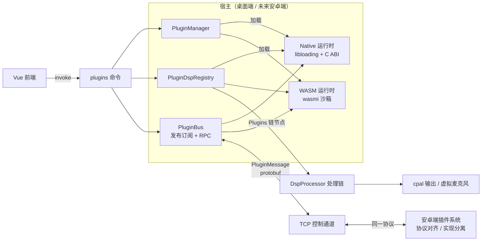
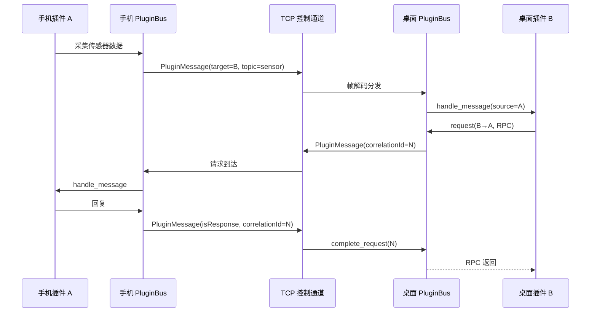

# 插件系统总览

## 目标

- 双运行时：**Native**（cdylib）与 **WASM** 插件，统一抽象、统一清单、统一协议
- 插件可插入 DSP 处理链、注册 UI 面板、订阅事件、跨端收发消息
- 桌面端（Tauri）与未来安卓端共用同一套 Manifest / Host API 能力描述 / 跨端消息协议，仅加载实现不同
- 最小侵入接入现有 `tauri-app` 架构，三个前端（GUI / CLI / TUI）共用同一服务器核心

## 架构图

## 双运行时说明

| 维度 | Native（cdylib） | WASM |
| --- | --- | --- |
| 载体 | `.so` / `.dylib` / `.dll` | `.wasm` 模块 |
| 加载方式 | `libloading` + 版本化 C ABI | `wasmi` 纯 Rust 解释器 |
| 性能 | 最高，可直连系统 API | 解释执行，适合逻辑类 |
| 系统能力 | 全部（驱动、ONNX、音频设备） | 无（内存沙箱 + 宿主授权） |
| 实时安全 | 由插件保证，宿主按 `realtimeSafe` 声明信任 | 默认 best-effort，禁止声明 realtimeSafe |
| 典型用途 | 实时 DSP、虚拟设备、深度集成 | 逻辑扩展、UI 面板、自动化、轻量处理 |
| 跨平台 | 每平台独立构建产物 | 单产物全平台（含未来安卓） |

## 与现有 DSP / 音频服务的关系

- 音频线程位于 `src-tauri/src/commands/system.rs`（`start_server_inner`），解码后调用 `micyou_audio::DspProcessor::process`
- 处理链由 `settings.json` 的 `processing_chain` 驱动（AEC → 降噪 → 去混响 → EQ → 放大 → AGC → VAD）
- 插件系统通过 `DspProcessor::set_external_hook` 注入外部阶段，链中合成节点 **`Plugins`** 触发
- 宿主启动时若存在已启用的 DSP 插件，自动把 `Plugins` 节点插入 AEC 之后（用户可在 GUI 中重新排序）
- 插件节点间顺序由 `PluginDspRegistry` 管理（`first` 优先，再按插件 id 排序保证确定性）
- 单个插件节点失败只记日志并旁路，不影响整条链

## 跨端同步模型

- 消息格式：protobuf `PluginMessage`（`proto/network.proto`），挂载在 `MessageWrapper` 字段 7
- 传输：桌面端通过 TCP 控制通道（`tcp_server`）与手机控制会话
- 语义：发布订阅（topic）+ 请求响应（correlationId）+ 广播（空 target）
- 安卓端复用同一协议与总线语义，仅替换传输实现与插件加载实现

## 插件分类

| 分类 | 说明 | 推荐运行时 |
| --- | --- | --- |
| DSP / Realtime Processor | 实时音频处理节点 | Native（WASM 受限，best-effort） |
| Utility / Service | 后台逻辑、自动化、网络、文件 | WASM / Native |
| UI / Panel | 前端配置面板或可视化组件 | WASM（+ Vue 注册） |
| Bridge / Sync | 跨端状态同步 | Native / WASM |
